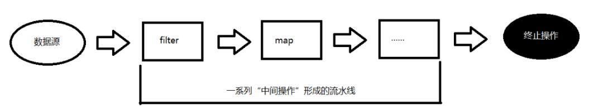

# Stream API
Stream API ( java.util.stream) 把真正的函数式编程风格引入到Java中。这
是目前为止对Java类库最好的补充，因为Stream API可以极大提供Java程
序员的生产力，让程序员写出高效率、干净、简洁的代码。

Stream 是 Java8 中处理集合的关键抽象概念，它可以指定你希望对集合进
行的操作，可以执行非常复杂的查找、过滤和映射数据等操作。 使用
Stream API 对集合数据进行操作，就类似于使用 SQL 执行的数据库查询。
也可以使用 Stream API 来并行执行操作。简言之，Stream API 提供了一种
高效且易于使用的处理数据的方式。

Stream到底是什么呢？

是数据渠道，用于操作数据源（集合、数组等）所生成的元素序列。

“集合讲的是数据，Stream讲的是计算！”

### 为什么要使用Stream API
- 实际开发中，项目中多数数据源都来自于Mysql，Oracle等。但现在数据源可以更多了，有MongDB，Radis等，而这些NoSQL的数据就需要Java层面去处理。

- Stream 和 Collection 集合的区别：Collection 是一种静态的内存数据结构，而 Stream 是有关计算的。前者是主要面向内存，存储在内存中，后者主要是面向 CPU，通过 CPU 实现计算。

### 注意：
- Stream 自己不会存储元素。
- Stream 不会改变源对象。相反，他们会返回一个持有结果的新Stream。 
- Stream 操作是延迟执行的。这意味着他们会等到需要结果的时候才执行。

### Stream 的操作三个步骤
1. 创建 Stream

    一个数据源（如：集合、数组），获取一个流
2. 中间操作 

    一个中间操作链，对数据源的数据进行处理
3. 终止操作(终端操作) 

    一旦执行终止操作，就执行中间操作链，并产生结果。之后，不会再被使用
    
    

多个中间操作可以连接起来形成一个流水线，除非流水线上触发终止操作，否则中间操作不会执行任何的处理！而在终止操作时一次性全部处理，称为“惰性求值”。   