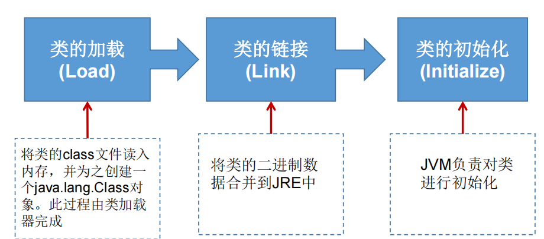
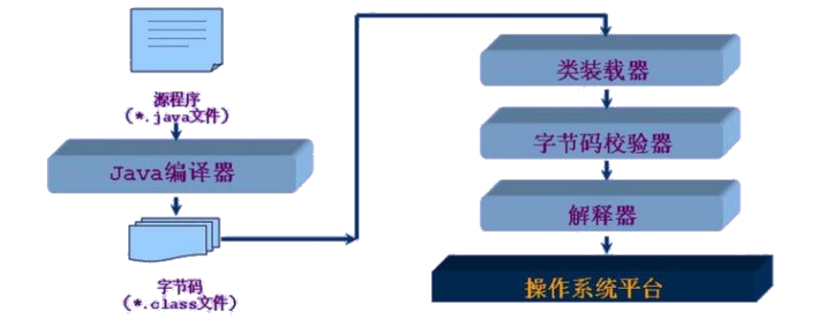
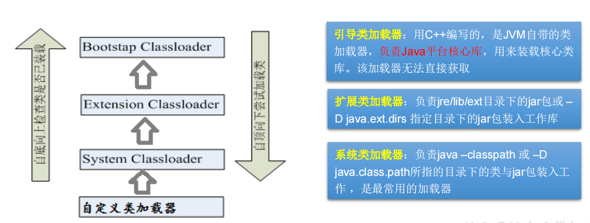

# Java的反射机制

Reflection（反射）是被视为动态语言的关键，反射机制允许程序在执行期借助于Reflection API取得任何类的内部信息，并能直接操作任意对象的内部属性及方法。

加载完类之后，在堆内存的方法区中就产生了一个Class类型的对象（一个类只有一个Class对象），这个对象就包含了完整的类的结构信息。我们可以通过这个对象看到类的结构。这个对象就像一面镜子，透过这个镜子看到类的结构，所以，我们形象的称之为：反射。

>注意：Java不是动态语言，但Java可以称之为“准动态语言”，即Java有一定的动态性，就是因为我们可以利用反射机制、字节码操作获得类似动态语言的特性。Java的动态性让编程的时候更加灵活！

### Java反射机制提供的功能
- 在运行时判断任意一个对象所属的类
- 在运行时构造任意一个类的对象
- 在运行时判断任意一个类所具有的成员变量和方法
- 在运行时获取泛型信息
- 在运行时调用任意一个对象的成员变量和方法
- 在运行时处理注解
- 生成动态代理

# Class 类
在Object类中定义了以下的方法，此方法将被所有子类继承：
- public final Class getClass()

以上的方法返回值的类型是一个Class类，此类是Java反射的源头，实际上所谓反射从程序的运行结果来看也很好理解，即：可以通过对象反射求出类的名称。

对象照镜子后可以得到的信息：某个类的属性、方法和构造器、某个类到底实现了哪些接口。对于每个类而言，JRE 都为其保留一个不变的 Class 类型的对象。一个 Class 对象包含了特定某个结构(class/interface/enum/annotation/primitive type/void/[])的有关信息。 

- Class本身也是一个类
- Class 对象只能由系统建立对象
- 一个加载的类在 JVM 中只会有一个Class实例
- 一个Class对象实例对应的是一个加载到JVM中的一个.class文件
- 每个类的实例都会记得自己是由哪个 Class 实例所生成
- 通过Class可以完整地得到一个类中的所有被加载的结构
- Class类是Reflection的根源，针对任何你想动态加载、运行的类，唯有先获得相应的Class对象

### 关于java.lang.Class类的理解
程序经过javac.exe命令以后，会生成一个或多个字节码文件(.class结尾)。接着我们使用java.exe命令对某个字节码文件进行解释运行。相当于将某个字节码文件加载到内存中。此过程就称为类的加载。加载到内存中的类，我们就称为运行时类，此运行时类，就作为Class的一个实例。
    
换句话说，Class的实例就对应着一个运行时类。

加载到内存中的运行时类，会缓存一定的时间。在此时间之内，我们可以通过不同的方式来获取此运行时类。
### Class类的常用方法
- static Class forName(String name) 返回指定类名 name 的 Class 对象
- Object newInstance() 调用缺省构造函数，返回该Class对象的一个实例
- getName() 返回此Class对象所表示的实体（类、接口、数组类、基本类型或void）名称
- Class getSuperClass() 返回当前Class对象的父类的Class对象
- Class [] getInterfaces() 获取当前Class对象的接口
- ClassLoader getClassLoader() 返回该类的类加载器
- Class getSuperclass() 返回表示此Class所表示的实体的超类的Class
- Constructor[] getConstructors() 返回一个包含某些Constructor对象的数组
- Field[] getDeclaredFields() 返回Field对象的一个数组
- Method getMethod(String name,Class … paramTypes)返回一个Method对象，此对象的形参类型为paramType

### 哪些类型可以有Class对象？
- class： 外部类（包含Class自身），成员(成员内部类，静态内部类)，局部内部类，匿名内部类
- interface：接口
- []：数组
- enum：枚举
- annotation：注解@interface
- primitive type：基本数据类型
- void

### 类的加载过程



1. 加载：将class文件字节码内容加载到内存中，并将这些静态数据转换成方法区的运行时数据结构，然后生成一个代表这个类的java.lang.Class对象，作为方法区中类数据的访问入口（即引用地址）。所有需要访问和使用类数据只能通过这个Class对象。这个加载的过程需要类加载器参与。 

2. 链接：将Java类的二进制代码合并到JVM的运行状态之中的过程。
    - 验证：确保加载的类信息符合JVM规范，例如：以cafe开头，没有安全方面的问题
    - 准备：正式为类变量（static）分配内存并设置类变量默认初始值的阶段，这些内存都将在方法区中进行分配。 解析：虚拟机常量池内的符号引用（常量名）替换为直接引用（地址）的过程。 

3. 初始化：
    - 执行类构造器<clinit>()方法的过程。类构造器<clinit>()方法是由编译期自动收集类中所有类变量的赋值动作和静态代码块中的语句合并产生的。（类构造器是构造类信息的，不是构造该类对象的构造器）。 
    - 当初始化一个类的时候，如果发现其父类还没有进行初始化，则需要先触发其父类的初始化。 
    - 虚拟机会保证一个类的<clinit>()方法在多线程环境中被正确加锁和同步
    
### 什么时候会发生类初始化？    
1. 类的主动引用（一定会发生类的初始化） 
    - 当虚拟机启动，先初始化main方法所在的类 
    - new一个类的对象
    - 调用类的静态成员（除了final常量）和静态方法
    - 使用java.lang.reflect包的方法对类进行反射调用
    - 当初始化一个类，如果其父类没有被初始化，则先会初始化它的父类
2. 类的被动引用（不会发生类的初始化） 
    - 当访问一个静态域时，只有真正声明这个域的类才会被初始化
    - 当通过子类引用父类的静态变量，不会导致子类初始化
    - 通过数组定义类引用，不会触发此类的初始化
    - 引用常量不会触发此类的初始化（常量在链接阶段就存入调用类的常量池中了）
    
### 类加载器的作用

- 类加载的作用：将class文件字节码内容加载到内存中，并将这些静态数据转换成方
法区的运行时数据结构，然后在堆中生成一个代表这个类的java.lang.Class对象，作为
方法区中类数据的访问入口。

- 类缓存：标准的JavaSE类加载器可以按要求查找类，但一旦某个类被加载到类加载器
中，它将维持加载（缓存）一段时间。不过JVM垃圾回收机制可以回收这些Class对象。
  
### 类加载器ClassLoader  



1. 获取一个系统类加载器
    ```java
    ClassLoader classloader = ClassLoader.getSystemClassLoader();
    System.out.println(classloader);
    ```

2. 获取系统类加载器的父类加载器，即扩展类加载器

    ```java
    classloader = classloader.getParent();
    System.out.println(classloader);
    ```

3. 获取扩展类加载器的父类加载器，即引导类加载器
    ```java
    classloader = classloader.getParent();
    System.out.println(classloader);
    ```

4. 测试当前类由哪个类加载器进行加载
    ```java
    classloader = Class.forName("exer2.ClassloaderDemo").getClassLoader();
    System.out.println(classloader);
    ```


