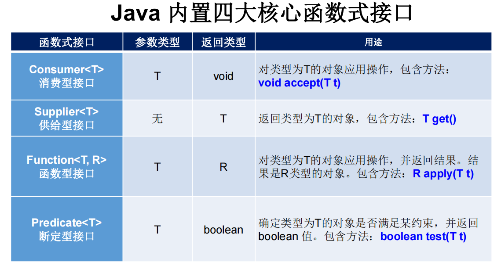
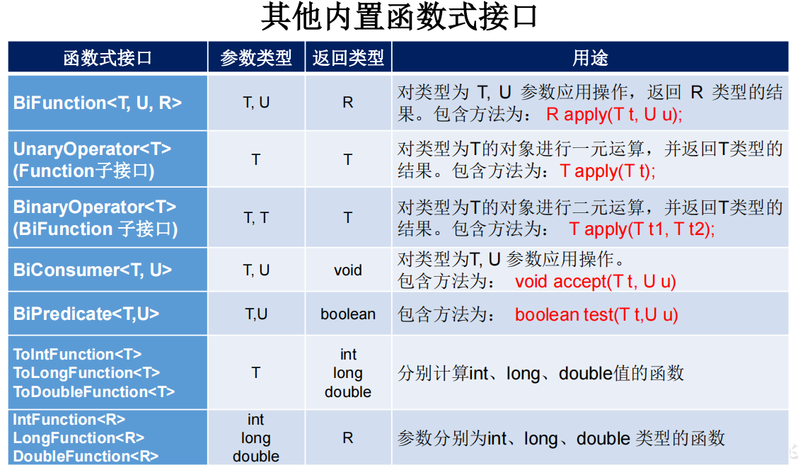

# 函数式接口
函数式接口(Functional Interface)就是保证有且仅有一个抽象方法，其他与普通接口无异的接口。

函数式接口可以被隐式转换为 lambda 表达式。

Lambda 表达式和方法引用（实际上也可认为是Lambda表达式）上。

注意，如果接口声明了一个覆盖java.lang.Object的全局方法之一的抽象方法，那么它不会计入接口的抽象方法数量中，因为接口的任何实现都将具有java.lang.Object或其他地方的实现。
所以，虽然Comparator虽然有两个抽象方法：

- int compare(T o1, T o2);
- boolean equals(Object obj);

但其中 equals为Object的方法，不算入内，所以Comparator可以作为函数式接口。

### 注解
我们可以在一个接口上使用 @FunctionalInterface 注解，这样做可以检查它是否是一个函数式接口。同时 javadoc 也会包含一条声明，说明这个
接口是一个函数式接口。

### 内置函数式接口
在java.util.function包下定义了Java 8 的丰富的函数式接口。

